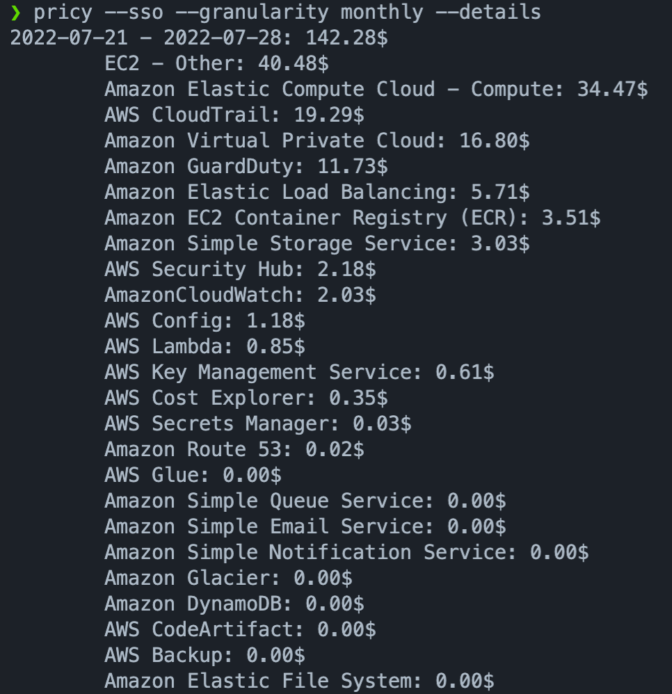

# Pricy


## Install

```bash
brew tap stangirard/tap
brew install pricy
```

## Run

```bash
pricy
```

If you are using sso for credentials on aws

```bash
pricy --sso
```

## Usage

There are a couple of parameters that you can use
- `--month`: Run the report for last month instead of last week
- `--details`: Show the details of the report with the pricing by service
- `--sso`: Use sso for credentials
- `--csv`: Output the report as csv to `reports.csv`
- `--granularity`: Granularity of the report, can be `daily`,  `monthly`

## Example

### Report Generation

```bash
pricy --sso --granularity monthly --details
```

Generates a report for the price since the beginning last week with granularity of a month

<p align="center">

<p align="center">

### CSV Generation

```bash
pricy --sso --granularity monthly --month  --csv
```

Generates a csv report for the price  from one month ago

<p align="center">

<p align="center">