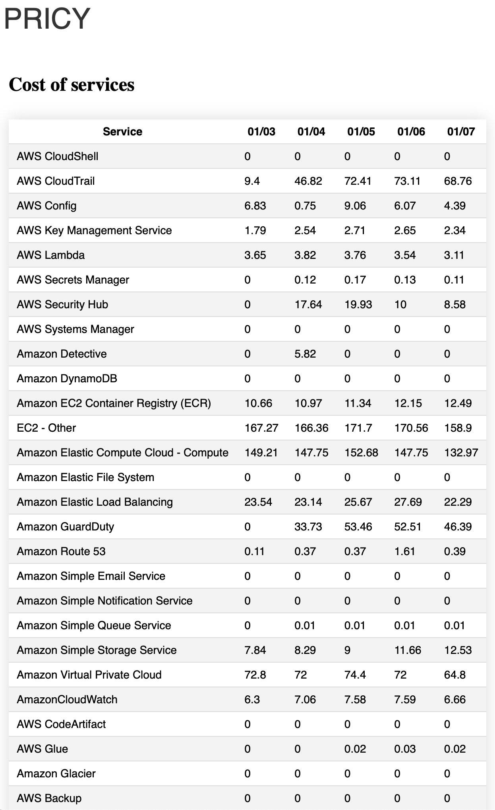
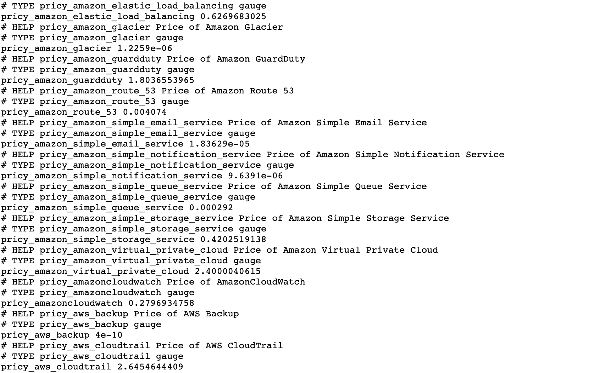

# Pricy


## Install

```bash
brew tap stangirard/tap
brew install pricy
```

## Run

```bash
pricy
```

If you are using sso for credentials on aws

```bash
pricy --sso
```

## Usage

### Cloud Providers

These are the flags required for enabling a cloud provider
- `--aws` - Enable AWS
  - `--sso`: Use sso for credentials for `aws`
- `--azure` - Enable Azure
  - `subscription`: Azure subscription id you want the report to be generated for

### Flags for configuration

There are a couple of parameters that you can use
- `--details`: Show the details of the report with the pricing by service
- `--csv`: Output the report as csv to `reports.csv`
- `--evolution`: Show the evolution of the report as `evolution.csv`
- `--days`: Number of days to look back for
- `--interval`: Date Interval on which the report is generated (Default last 14 days) (Format: YYYY-MM-DD:YYYY-MM-DD)
- `--granularity`: Granularity of the report, can be `daily`,  `monthly`
- `--html`: Output the report as html to `pricy.html`
- `--prometheus`: Outputs as prometheus metrics on `http://localhost:2112/metrics` that can be scraped by prometheus
- `--gsheets`: Outputs the report to a google sheets spreadsheet

## Example

### Generate a Google Spreadsheet


You need to export the variable `GOOGLE_APPLICATION_CREDENTIALS` to the path of your json file which contains your OAuth2 credentials.
In oder to get the credentials, you follow this guide:
- [Google Cloud Platform](https://developers.google.com/sheets/api/quickstart/go)
- Activate Sheets API
- Create a credentials for Oauth2 for Desktop Application


```bash
export GOOGLE_APPLICATION_CREDENTIALS="/path/to/credentials.json"
```

```bash
pricy --aws --sso --csv --gsheet --days 30
```

<p align="center">

<p align="center">

### HTML Report Generation 

```bash
pricy --aws --sso --days 150 --granularity monthly --html
```

Generates a report for the price starting a 150 days ago

<p align="center">

<p align="center">


### Prometheus Metrics

```bash
pricy --aws --sso --prometheus  
```

Generates the prometheus metrics for the price updating every 8 hours

<p align="center">

<p align="center">
